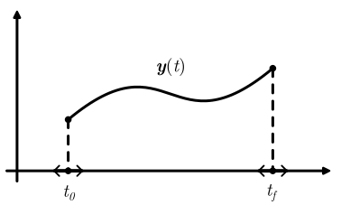

```@meta
CurrentModule = DynOptInterface
```

# Dynamic Optimization

## Phases and Dynamic Variables

Phases represent intervals $t \in [t_0, t_f]$ on which dynamic variables $t \mapsto \boldsymbol y(t)$ are defined.



## Problem Formulation

MOI's [Function-in-Set form problem](@extref Standard-form-problem) is extended as follows.
Dynamic Optimization Problems deal with finding variables $x \in \mathbb R^{n_x}$, phase boundaries $t_0^{(i)} \in \mathbb R$, $t_f^{(i)} \in \mathbb R$, and dynamic variables $\boldsymbol y^{(i)} : [t_0^{(i)}, t_f^{(i)}] \rightarrow \mathbb R^{n_y^{(i)}}$ that

```math
\begin{align*}
\begin{array}{rl}
    \text{minimize} \quad &
    m \big( \boldsymbol y(t_0), \boldsymbol y(t_f), t_0, t_f, x \big) +
    \displaystyle{\sum_{i=1}^{n_p} \bigg[
    \int_{t_0^{(i)}}^{t_f^{(i)}} \ell^{(i)} \big( \boldsymbol y^{(i)}(t), t, x \big) \textrm{d}t \bigg],}\\
    %
    \text{subject to} \quad &
    \begin{aligned}
        f(x) & \in \mathcal S,\\
        %
        d^{(i)}\big(\dot{\boldsymbol y}^{(i)}(t), \boldsymbol y^{(i)}(t), t, x) & \in \mathcal D^{(i)},
        \quad \forall t \in [t_0^{(i)}, t_f^{(i)}],
        \quad \forall i \in \{1, 2, ..., n_p\},\\
        b(\boldsymbol y(t_0), \boldsymbol y(t_f), t_0, t_f, x) &\in \mathcal B,
    \end{aligned}
\end{array}
\end{align*}
```

where:
* ``f`` are [`MOI.AbstractScalarFunction`](@extref MathOptInterface.AbstractScalarFunction)s
* ``\ell`` and ``d`` are [`AbstractDynamicFunction`](@ref)s
* ``m`` and ``b`` are [`AbstractBoundaryFunction`](@ref)s


## Dynamic Functions

* [`PhaseIndex`](@ref)
* [`DynamicVariableIndex`](@ref)
* [`LinearDynamicFunction`](@ref)
* [`PureQuadraticDynamicFunction`](@ref)
* [`NonlinearDynamicFunction`](@ref)
* [`Derivative`](@ref)
* [`ExplicitDifferentialFunction`](@ref)

## Boundary Functions

* [`Initial`](@ref)
* [`Final`](@ref)
* [`Linkage`](@ref)
* [`NonlinearBoundaryFunction`](@ref)
* [`Integral`](@ref)
* [`MultiPhaseIntegral`](@ref)
* [`Bolza`](@ref)